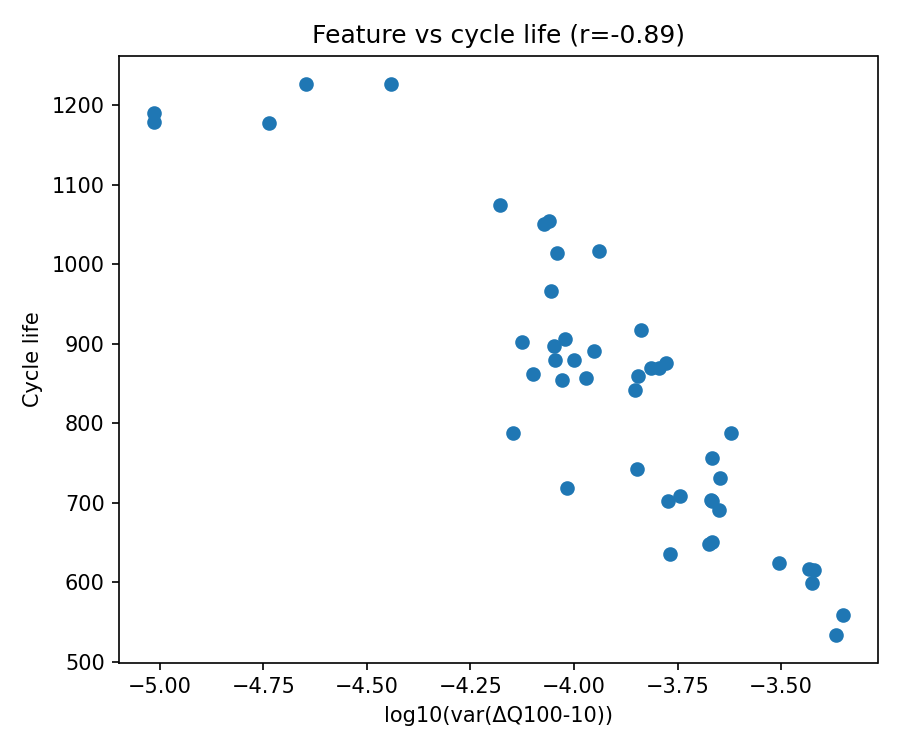
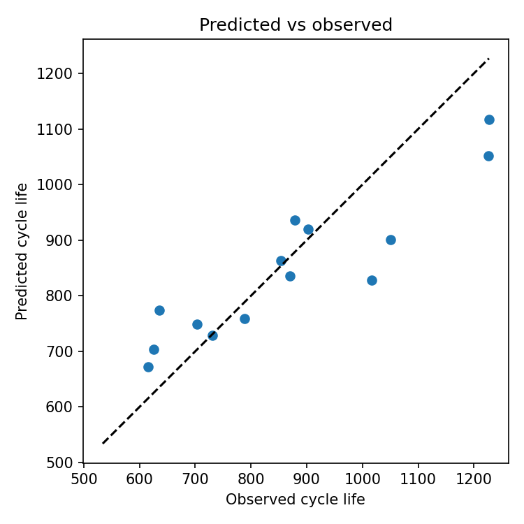

 


# lfp-cycle-life-prediction
# Early-Life Cycle-Life Prediction for LFP/Graphite Cells

Predicting the full cycle life of lithium-iron-phosphate (LFP)/graphite cells from only the **first 100 cycles**, reproducing and extending the approach of Severson et al. (*Nature Energy*, 2019). This is a self-directed project using the publicly available dataset; it demonstrates data-driven battery-lifetime modeling grounded in electrochemical intuition.

## Motivation

Manufacturers need to screen cells for lifetime *early* — long before capacity has visibly degraded. By cycle 100, discharge capacity has barely dropped (all cells here sit near ~1.08 Ah of a 1.1 Ah nominal), so capacity alone cannot rank cells. The key idea is that the **change in the discharge voltage curve** between early cycles carries a strong lifetime signal before capacity fade is measurable.

## Data

- Source: [Severson et al. 2019 dataset](https://data.matr.io/1/projects/5c48dd2bc625d700019f3204) (CC BY 4.0)
- Scope (this version): batch `2017-05-12`, **46 commercial A123 APR18650M1A LFP/graphite cells**, cycled to failure under 72 fast-charging policies at 30 °C.
- Cycle life in this batch ranges 534–1227 cycles (mean 845) — a ~2.3× spread driven by charging protocol.

## Method

**Feature engineering (physics-motivated).** The central feature is the base-10 log of the variance of ΔQ(V) — the difference between the cycle-100 and cycle-10 discharge capacity curves interpolated onto a common voltage grid:

```
feature = log10( Var_V [ Q_100(V) − Q_10(V) ] )
```

This captures how much the discharge curve *reshapes* (from growing impedance / lithium-inventory loss) even while total capacity looks unchanged. Additional features: log|min ΔQ|, remaining capacity at cycle 100, and the early capacity-fade slope (cycles 2–100).

**Models.** A single-feature linear baseline vs. an ElasticNet (L1/L2-regularized linear) on all four features, with standardization and 5-fold cross-validation.

## Results

| Model | Features | Test MAPE | Test RMSE |
|-------|----------|-----------|-----------|
| Baseline (linear) | log-var ΔQ only | 8.8 % | ~100 cycles |
| ElasticNet | 4 features | 8.8 % | ~99 cycles |

- **Single-feature correlation with cycle life: Pearson r = −0.886** (reproduces the paper's ~−0.9).
- **ElasticNet 5-fold CV RMSE = 85.9 ± 11.6 cycles** (~10 % of mean life).
- The regularized multi-feature model does *not* beat the single physics-motivated feature — evidence that the ΔQ(V)-variance feature already captures most of the predictive signal, and that additional features risk overfitting on n=46.

## Domain interpretation

The ΔQ(V)-variance signal reflects early electrochemical degradation — growth of cell impedance and loss of lithium inventory (LLI) — that redistributes the discharge voltage profile before it shows up as bulk capacity loss. Cells whose voltage curves reshape more in the first 100 cycles fail sooner. This is why an early, capacity-invisible feature can rank long-term durability.

## Limitations & next steps

- **Single batch (n = 46).** The full study uses 124 cells across three batches with a dedicated train / primary-test / secondary-test split. Extending to all batches (and reproducing that split) is the planned next step and will give a more robust, less variance-prone estimate.
- Cycle indices are positional (≈ cycles 10 and 100); exact-cycle-number alignment is a minor refinement.

## Reproduce

1. Download the batch-1 MATLAB struct (`2017-05-12_batchdata_updated_struct_errorcorrect.mat`, 2.82 GB) from the dataset link above.
2. Open the notebook in Google Colab, mount Google Drive, set the file path.
3. Run cells 1–7 (load → EDA → ΔQ(V) feature → model). Requires `h5py, numpy, pandas, scikit-learn, scipy, matplotlib`.

## Reference

Severson, K.A., Attia, P.M., Jin, N. et al. *Data-driven prediction of battery cycle life before capacity degradation.* **Nature Energy** 4, 383–391 (2019).

